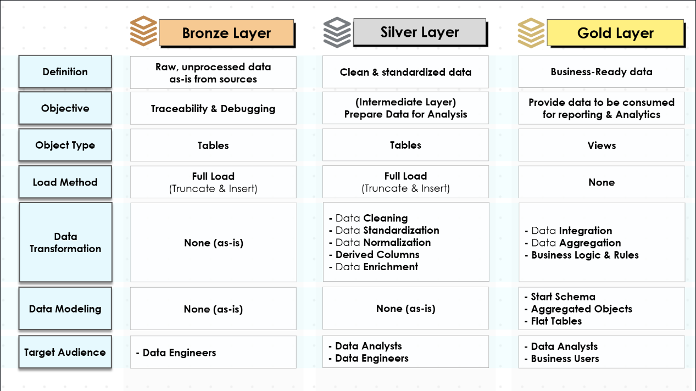
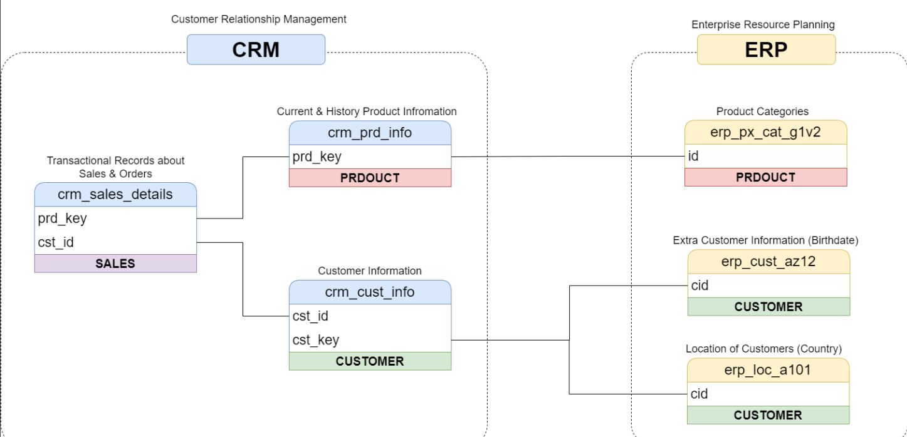
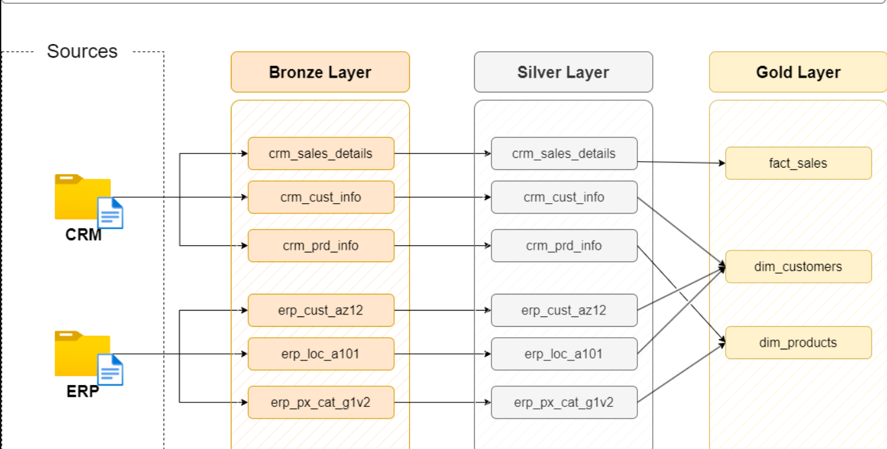
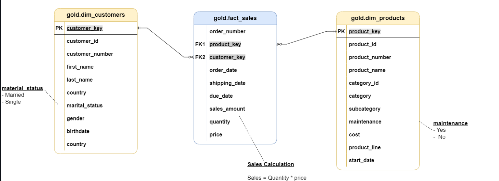

# 🏗️ SQL Data Warehouse 

An end-to-end Data Warehouse project built using SQL Server that demonstrates modern Data Engineering practices including ETL, Data Cleaning, Data Integration, Data Modeling and Analytics.

---

# Project Overview

This project integrates raw business data from two independent operational systems (CRM and ERP), transforms it into clean and standardized datasets, and finally delivers business-ready analytical data using a Star Schema.

The project follows the Medallion Architecture consisting of:

- Bronze Layer (Raw Data)
- Silver Layer (Cleaned Data)
- Gold Layer (Business Ready Data)

---

# Project Architecture

<p align="center">

</p>

The ETL pipeline consists of:

```
CRM + ERP
      │
      ▼
Bronze Layer
      │
      ▼
Silver Layer
      │
      ▼
Gold Layer
      │
      ▼
Power BI / Reporting / Analytics
```

---

# Source Systems

The warehouse receives data from two operational systems.

<p align="center">

</p>

## CRM

Contains

- Sales Transactions
- Customer Information
- Product Information

## ERP

Contains

- Product Categories
- Customer Birthdate
- Customer Country

---

# Medallion Architecture

<p align="center">

</p>

## Bronze Layer

Purpose

- Store raw data exactly as received
- Maintain source traceability
- Enable debugging

Characteristics

- No transformations
- Full Load
- Raw Tables

---

## Silver Layer

Purpose

Prepare clean data for analytics.

Operations

- Data Cleaning
- Standardization
- Normalization
- Data Validation
- Derived Columns
- Data Enrichment

---

## Gold Layer

Purpose

Deliver business-ready datasets optimized for reporting.

Contains

- Dimension Tables
- Fact Tables
- Star Schema
- Business Rules
- Analytical Models

---

# Data Warehouse Flow

```
CSV Files
     │
     ▼
Bronze Tables
     │
Cleaning
Standardization
Validation
     │
     ▼
Silver Tables
     │
Business Rules
Joins
Transformations
     │
     ▼
Gold Star Schema
```

---

# Gold Layer Data Model

<p align="center">

</p>

The Gold layer follows a Star Schema consisting of:

### Dimension Tables

- dim_customers
- dim_products

### Fact Table

- fact_sales

Relationships

| Parent | Child | Relationship |
|---------|-------|--------------|
| dim_customers | fact_sales | One-to-Many |
| dim_products | fact_sales | One-to-Many |

---

# ETL Process

```
Raw CSV Files

↓

Bronze Layer

↓

Data Cleaning

↓

Data Validation

↓

Standardization

↓

Business Rules

↓

Star Schema

↓

Reporting & Analytics
```

---

# Technologies Used

- SQL Server
- T-SQL
- CSV Files
- Star Schema
- ETL
- Data Warehouse
- Medallion Architecture
- Git
- GitHub

---

# Project Structure

```
sql-data-warehouse-project/

│
├── datasets/
│
├── scripts/
│     ├── bronze/
│     ├── silver/
│     └── gold/
│
├── docs/
│     ├── DATA_CATALOG.md
│     └── images/
│
├── README.md
│
└── LICENSE
```

---

# Documentation

Detailed table documentation can be found here:

📖 **[Data Catalog](docs/DATA_CATALOG.md)**

---

# Author

Atharv Bhore